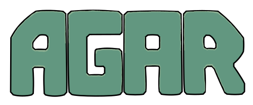

### What is it?

Agar is a type of sugar polymer obtained from seaweed and red algae. It becomes gelatinous in water and is primarly used as a culture medium for microbiological work. **Agar** (or ***LibAgar***) is also the name of an open source GUI toolkit, a set of software libraries for building graphical user interfaces.

Agar works with a wide variety of platforms and graphics systems, from modern desktops to classic consoles and embedded devices. Its low-level layers are modular, extensible and easily ported to new hardware platforms and graphics systems. Standard [drivers](https://libagar.org/man3/AG_Driver) include:
* [**cocoa**](https://libagar.org/man3/AG_DriverCocoa) ([_MacOS_](https://en.wikipedia.org/wiki/MacOS), OpenGL, multi-window)
* [**glx**](https://libagar.org/man3/AG_DriverGLX) ([_X Windows_](https://x.org), OpenGL, multi-window)
* [**sdl2fb**](https://libagar.org/man3/AG_DriverSDL2FB) ([_SDL 2.0_](https://libsdl.org), frame-buffer, single-window)
* [**sdl2gl**](https://libagar.org/man3/AG_DriverSDL2GL) ([_SDL 2.0_](https://libsdl.org), OpenGL, single-window)
* [**sdl2mw**](https://libagar.org/man3/AG_DriverSDL2MW) ([_SDL 2.0_](https://libsdl.org), OpenGL, multi-window)
* [**sdlfb**](https://libagar.org/man3/AG_DriverSDLFB) ([_SDL 1.2_](https://libsdl.org), frame-buffer, single-window)
* [**sdlgl**](https://libagar.org/man3/AG_DriverSDLGL) ([_SDL 1.2_](https://libsdl.org), OpenGL, single-window)
* [**wgl**](https://libagar.org/man3/AG_DriverWGL) ([_Windows_](https://en.wikipedia.org/wiki/Microsoft_Windows), OpenGL, multi-window)

For graphics systems without multi-window capabilities (or cases where a MDI-style interface is preferred over desktop integration), a [**single-window**](https://libagar.org/man3/AG_DriverSw) mode is provided in which case Agar provides its own internal window manager.

Agar's cascading [**Style Engine**](https://libagar.org/man3/AG_StyleSheet) separates presentation details from underlying code. Style attributes including typography, colors, paddings and spacings of widgets can be assigned from a [style sheet](https://dev.csoft.net/agar/trunk/gui/style.css) using a common language. **Style Editor** tool allows style changes to be viewed in real-time.

While Agar includes a standard library of [general-purpose widgets](https://libagar.org/man3/AG_Intro#AGAR-GUI:_STANDARD_WIDGETS), it is also designed to be extended externally. New Agar widgets can be implemented as part of an application or of an external library. Complex user interface elements can be realized often in few lines of code. The [class registration interface](https://libagar.org/man3/AG_Object#CLASSES) simplifies the process.

To aid debugging, the Debug version performs type checking, object-validity and class-membership tests against object pointers passed to API calls at run-time. Agar is [thread-safe](https://libagar.org/man3/AG_Threads) when built with threads support. Public API calls are reentrant unless documented otherwise, although Agar does not rely on threads for its own operation.

### Libraries included (stable)

* [CORE](https://libagar.org/man3/AG_Intro#AGAR-CORE): Platform, I/O, object system (non graphical)
* [GUI (Base)](https://libagar.org/man3/AG_Intro#AGAR-GUI:_BASE_SYSTEM): GUI base framework
* [GUI (Widgets)](https://libagar.org/man3/AG_Intro#AGAR-GUI:_STANDARD_WIDGETS): GUI standard widgets
* [MATH](https://libagar.org/man3/AG_Intro#AGAR-MATH): Matrices, vectors & advanced rendering methods
* [NET](https://libagar.org/man3/AG_Intro#AGAR-NET): Network interface, HTTP application server
* [VG](https://libagar.org/man3/AG_Intro#AGAR-VG): Vector graphics

### Libraries included (beta)

* [AU](https://libagar.org/man3/AG_Intro#AGAR-AU): Audio interface library
* [SG](https://libagar.org/man3/AG_Intro#AGAR-SG): General-purpose 3D engine
* [SK](https://libagar.org/man3/AG_Intro#AGAR-SK): Sketches with constraints
* [MAP](https://libagar.org/man3/AG_Intro#AGAR-MAP): Tile engine

### How to install

See the provided [**INSTALL.md**](INSTALL.md) or an online installation guide:
- **[on BSD](https://libagar.org/docs/inst/bsd.html)** 
- **[on Linux](https://libagar.org/docs/inst/linux.html)** 
- **[on MacOS](https://libagar.org/docs/inst/osx.html)** 
- **[on Unix](https://libagar.org/docs/inst/unix.html)** 
- **[on Windows with MingGW32](https://libagar.org/docs/inst/win-mingw.html)** 
- **[on Windows with MingGW64](https://libagar.org/docs/inst/win-mingw64.html)** 
- **[on Windows with Visual Studio](https://libagar.org/docs/inst/win-vs.html)** 

### Availability

#### Latest Stable Release

* [Download Source](https://libagar.org/download.html#stable)

#### Latest Development Sources

* Main Repo: [https://dev.csoft.net/agar/trunk](https://dev.csoft.net/agar/trunk)
* On GitHub: [JulNadeauCA/libagar](https://github.com/JulNadeauCA/libagar)

#### License

* [BSD 2-Clause License](https://libagar.org/license.html)
* [OFL 1.1](https://libagar.org/license-ofl.html) (core fonts)

### Contributing

* Sign up to the [**Patreon**](https://patreon.com/libagar) for exclusive content including articles, code and tutorials.
* [**Contribute**](https://libagar.org/contribute.html) by donating, supporting our sponsors, reporting bugs or submitting code.

